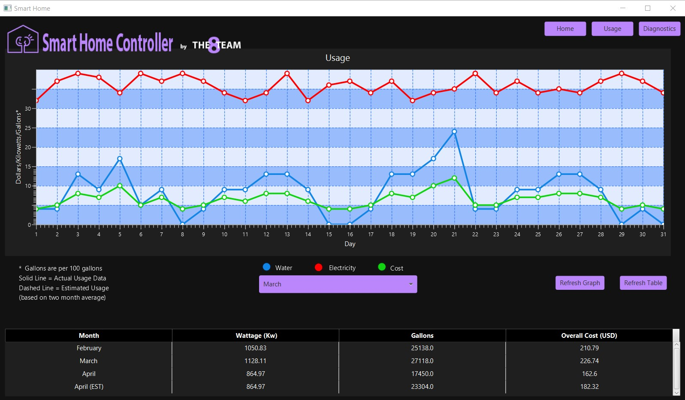

 

## Description
Welcome to Smart Home Controller, a home IoT application created by six UAB students. Smart Home Controller's goal is to help inform users about their home. The Home screen on the Smart Home Controller displays a floorplan of your house that contains togglable sensors to control your lights, water usage, appliances, doors, windows, and more! Our application even features a Usage screen that displays your water and electricity usage in graph and table format, and it will tell you the total cost for each day or the overall month. A Diagnostic screen is also available on the Smart Home Controller. The Diagnostic screen allows you to run simulations on the sensors in your house, so you can know exactly how much that sensor is costing you. The Smart Home Controller is also capable of automating your HVAC and can even display the current outside temperature. The Smart Home Controller has everything you need to systemically run your house at the touch of your fingertips. 


## Set Up Instructions
To run our project, type ```git clone https://gitlab.cs.uab.edu/CS499S2021/Team8/Smart_Home.git``` in your terminal to clone the repository. After that, open Eclipse, go
to "File" in the top right, and click on "Open Project from File System". Once there, choose the directory where you cloned the project and "Finish". Lastly, click on the imported
project and run it as a Java application. <br>

## Promotional Video
Check out this promotional video that walks you through the functionality of the Smart Home Controller. Created by Cameron Davis. 

[](http://www.youtube.com/watch?v=71wFHrUJ52g "Smart Home Controller Video")

## Screenshots
Home Page <br>
 <br> <br>
Usage Page <br>
 <br> <br>
Diagnostics Page <br>
 <br> <br>

## Contact Us
[Andy Wang](mailto:andywang@uab.edu) <br>
[Cameron Davis](mailto:camrhys@uab.edu) <br>
[Jessie Elkins](mailto:jelkins3@uab.edu) <br>
[John Michael Mizerany](mailto:jmmiz@uab.edu) <br>
[Jonathan Perz](mailto:jlperz@uab.edu) <br>
[Parth Patel](mailto:parth17@uab.edu) <br>